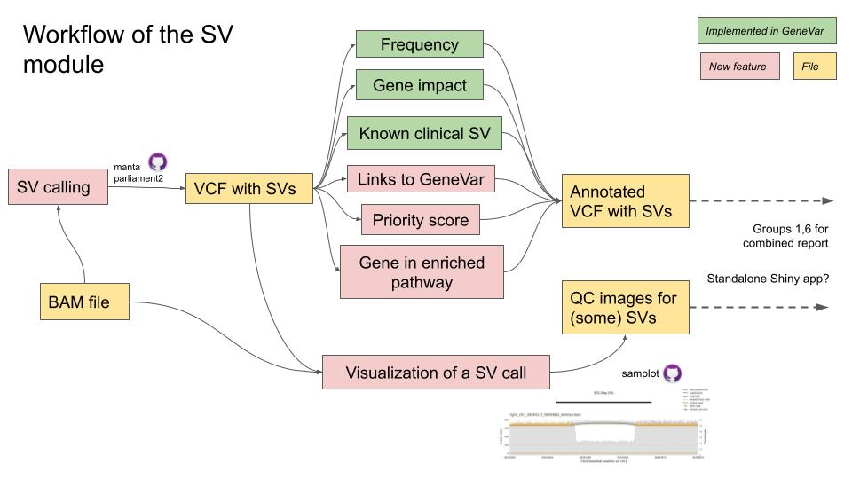

# clinical_SVs

Clinically reportable structural variant calls


## Contributors

Jean Monlong  - `Lead, Liaison`

Rupesh Kesharwani - `Sysadmin and code developer`

Pranav Khade - `Data Guru and curator`

Weiyu Zhou - `App Developer`

Ahmad Al Khleifat - `Writer`

## Slide deck

- [Google Slide live deck](https://docs.google.com/presentation/d/1il5xxWTMZ21IPLAy20KemnufYfgCAwfHNzxukKSW3e4/edit?usp=sharing)
- Local backup: [SV-Clinic.odp](SV-Clinic.odp)

## Goals

Write a **workflow and/or app** to **annotate structural variants** (SVs) calls with **clinically relevant information**.

Eventually, the workflow could call the SVs from sequencing reads (e.g. from a BAM file) and extract some QC information from raw reads.

## Overview Diagram



## Notes/Documentation

- Example file on [our test data](#test-data): [`test.clinical.sv.csv`](testdata/test.clinical.sv.csv)

The table contains the following columns.

| name       | description                                                           |
|------------|-----------------------------------------------------------------------|
| gene       | names of genes overlapped, separated by `\|`                          |
| variant_id | SV ID                                                                 |
| chr        | chromosome name                                                       |
| start      | start position                                                        |
| end        | end position                                                          |
| size       | size of the SV in bp                                                  |
| frequency  | allele frequency                                                      |
| svtype     | type of SV. E.g. DEL, DUP, INS, ...                                   |
| clinsv     | dbVar accession IDs of matching known clinical SVs (separated by `\|` |
| clinrk     | clinical importance rank, for example to select top 5 SVs             |

We will also run a gene set enrichment and highlight SVs in enriched pathways/diseases.
This is will represent a set of *patient-level* metrics.
The output will be a set of graphs (image files) 

## Installation

Install R packages. 
In R:

```r
install.packages(c('BiocManager', 'dplyr'))
BiocManager(c('GenomicRanges', 'rtracklayer', 'VariantAnnotation', 'jmonlong/sveval'))
```

## Quick Start

####To annotate a VCF with SV calls:

```
Rscript R/prepare_annotation_data.R annotation_data.RData   ## download and prepare annotations (makes 'annotation_data.RData')
Rscript R/annotate_vcf.R input.vcf annotation_data.RData output.vcf output.csv
```

####For example, for the [test data](#test-data)

```
Rscript R/annotate_vcf.R testdata/test.input.vcf annotation_data.RData testdata/test.clinical.sv.vcf testdata/test.clinical.sv.csv
```

####Test gene disease ontology, gene-disease association and pathways by KEGG and Reactome

```
cd demo_output

Rscript ../R/geneFunctionalAnnotation.R listofENSEMBLID.txt 0.05 EMSEMBL

```


## Component Details

Two ways to use our tools:

1. A **command-line workflow** that can do
   - SV discovery
   - Annotation
   - Automated QC graphs of supporting reads
1. An **interactive app** to annotate a VCF with SV calls and visualize the results.
   - Building on GeneVar but now the user can upload their own VCF

### SV calling

If needed SVs can be called using parliament2. 
We will provide commands to run this variant discovery and integrate it to the workflow

### Annotation of SVs in R

The different modules of the annotation are written as functions and saved in separate files.
Then the master annotation script can read a VCF, *source* these functions and use them to annotate the SVs. 
See the current master annotation script [`annotate_vcf.R`](R/annotate_vcf.R) and the different scripts *source*d inside.

The `server.R` file of the app can also use the same approach: source the same functions and use them to annotate a VCF before displaying the info in the app.

#### Annotation modules

The resources used in the modules are downloaded and prepared by the [`prepare_annotation_data.R`](R/prepare_annotation_data.R). 

- [X] [`annotate_genes.R`](R/annotate_genes.R) 
   - Gencode v35
   - Filter: keeps only SVs overlapping CDS regions.
   - Uses a "wide" format: new field *GENE* lists all genes overlapped separated by `|`.
- [X] [`annotate_frequency.R`](R/annotate_frequency.R) 
   - Uses the position and the *SVLEN*, *SVTYPE* fields to match SVs in the gnomAD-SV catalog (i.e. make sure the SV calls contains these fields).
   - Lenient matching criteria: 10% minimum reciprocal overlap; insertions can be as distant as 100 bp.
   - New field *AF* reports the maximum frequency across all the SVs matched in gnomAD-SV.
- [x] [`annotate_known_clinical_SVs.R`](R/annotate_known_clinical_SVs.R)
   - Known clinical SVs: dbVar *nstd102* study
- [ ] [`geneFunctionalAnnotation.R`](R/geneFunctionalAnnotation.R)
   - Need a list of genes similar to `demo/listofENSEMBLID.txt` (Other than ENTREZ Gene ID; such as SYMBOL / REFSEQ / ENSEMBL) to output a three types of Disease Ontology plots such as `(demo/geneAnnotation.png)` including a barplot (high level catogory), a dot plot (show upto 20 diseases association) and a disease-gene network graph.
   - The list of genes can be extracted from annotated vcf based on any SV types.
- [ ] Known SVs in cancer from COSMIC?

### Visualization of aligned reads around a SV

We could show the reads around a SV as a quality control if the BAM is available.
Either invent our own graph (for example in python), or run an existing tool like [samplot](https://github.com/ryanlayer/samplot).


## Test data

A 1000GP sample was SV called in [`python_scripts`](python_scripts) using parliament2.
For testing, we inject a SV that looks a bit like a known deletion in familial ovarian cancer.

```sh
grep "#" python_scripts/NA19461.final.manta.diploidSV.vcf > testdata/test.input.vcf
grep -v "#" python_scripts/NA19461.final.manta.diploidSV.vcf | awk '{if($7=="PASS"){print $0}}' >> testdata/test.input.vcf
cat testdata/add-for-test.vcf >> testdata/test.input.vcf
```
